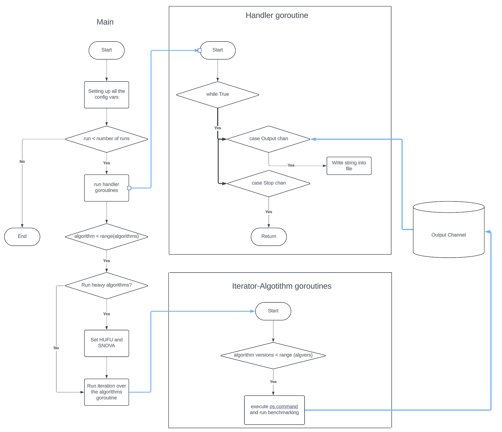

# PQC Signatures Benchmarking Script

This script benchmarks Post-Quantum Cryptography (PQC) algorithms, written in Golang using built-in libraries. The primary goal is to reduce the execution time of evaluation scripts and to standardize the results in multiple formats (CSV, JSON, and TXT).

## Solution Overview

- Utilizes Golang's built-in asynchronous mechanisms to execute each algorithm's benchmarking command in independent, thread-safe goroutines.
- Channels are used for synchronization between all goroutines, managed by independent handler goroutines.



## How to Install and Use

> **IMPORTANT:**  
> Run `./setup` in the root directory before executing any other scripts. All scripts should be run from the `scripts/` directory.

1. **Install Go:**  
   Ensure that Go is installed. You can download it from the official [Go website](https://go.dev/dl/) (version 1.22.5).

2. **Set Up Your Workspace:**  
   It's common to set your **GOPATH**.

3. **Build the Project:**
   - To compile the project into an executable, run:
     ```bash
     go build -o output_filename
     ```
   - Or run the script directly with:
     ```bash
     go run main.go
     ```

4. **Algorithm Versions and Variants:**
   - The script parses algorithm versions and their variants from files located in the `test_data/alg_variation_lists/` directory. The expected file format is:
     ```
     test_data/alg_variation_lists/
     ├── <algorithm>_variations.txt
     │   ├── algvariation1 (any string)
     │   └── algvariation2 (any string)
     └── <algorithm>_variations.txt
         ├── algvariation1 (any string)
         └── algvariation2 (any string)
     ```

5. **Output:**
   - Results are stored in the `test_data/results/` directory with filenames in the format `results_<run_number>_<YYYYMMDD>`, where `<run_number>` represents the run number and `<YYYYMMDD>` represents the current date. Files are overwritten if the script is executed on the same date.
   - Output formats include `.json`, `.csv`, and `.txt` files.
   - **page.html** is used to represent the results in a readable format and requires a `.json` result for uploading.

## Possible Enhancements and Upgrades

- Consider implementing further performance optimizations.
- Additional output formats or integration with other tools.
- Expand support for more PQC algorithms and variations.
- Adjust graph and metrics visualization tools (thanks to suggestions from @crt26):
  - Display C scripts in CPI cycles metric (in this case, data gathering and output format should be decided).
  - Transition from the single `.html` file solution to providing a standalone web application (frontend with backups).
