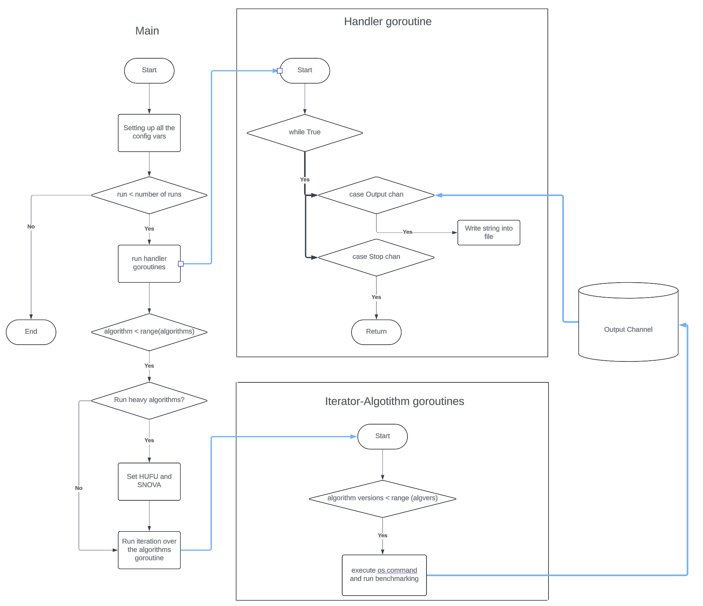

# Scripts execution
> [!IMPORTANT]
> Run ./setup in root directory before run | Run all the scripts in scripts/ directory
## Golang requirements
- Install Go: Ensure you have Go installed. You can download it from the official [Go website](https://go.dev/dl/) (ver 1.22.5)
- Set Up Your Workspace: It's common to set your **GOPATH**
- Build the project as executable:
```
go build -o output_filename
```
Or run it directly:
```
go run main.go
```
## Current features
- Algorithm results output in .csv and .txt formats
- Parallel thread-safe algorithm execution

## Future Enhancements
- JSON conversion and formatting
- HTML+JS dashboard

